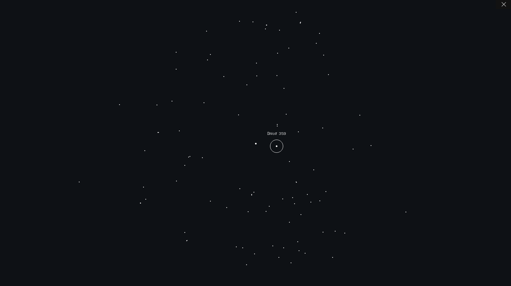

# StarMapper

Interactive map of our closest stellar neighbors using C++ and SDL2 along with data from SIMBAD

Can be modified to use any celestial data to visually display spatial information about stellar objects. This can be done by modifying and running the script res/simbad.txt and overwriting the res/stars.txt file with new stellar objects. Scale will also need to be changed to see objects close together.

# Future Improvements

Adding dynamic scale
Adding an information tab which gives extra information when a star is selected
Fixing exit button (Current requires ESC key to shutdown)
Adding UTF-8 Support

# Acknowledgements

This research has made use of the SIMBAD database,
operated at CDS, Strasbourg, France

2000,A&AS,143,9 , "The SIMBAD astronomical database", Wenger et al.
